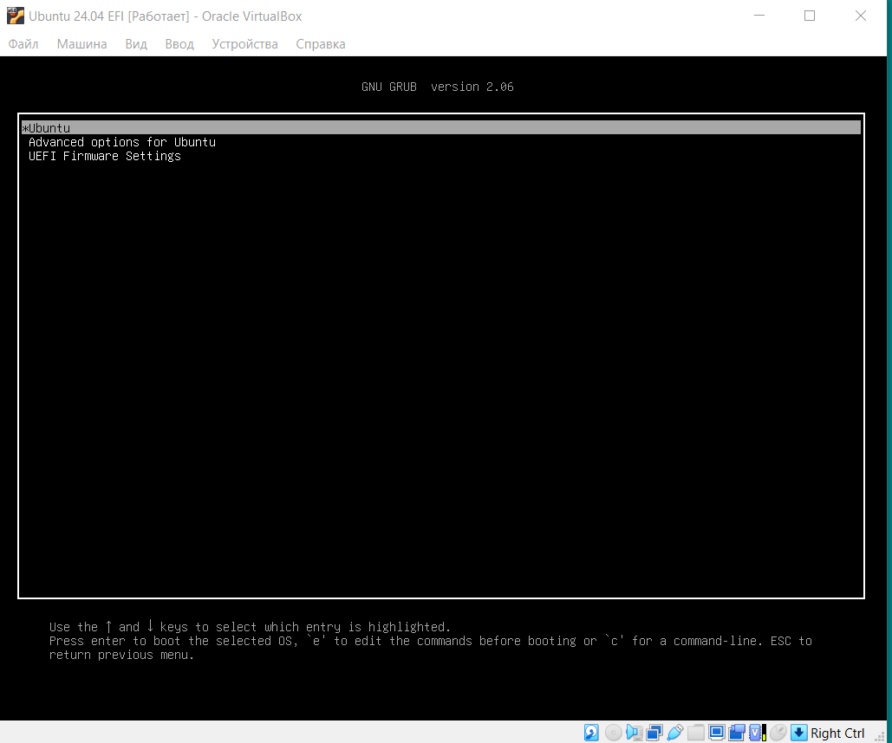
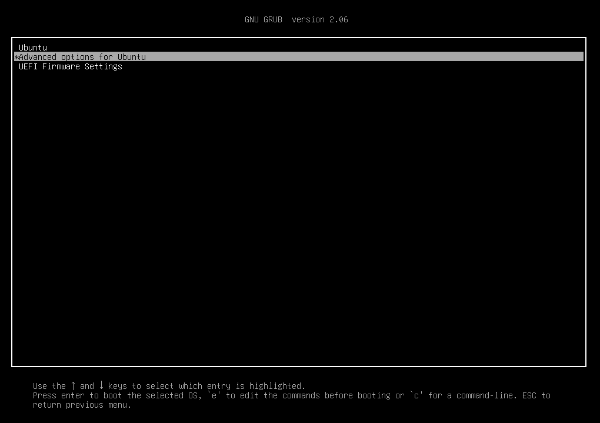
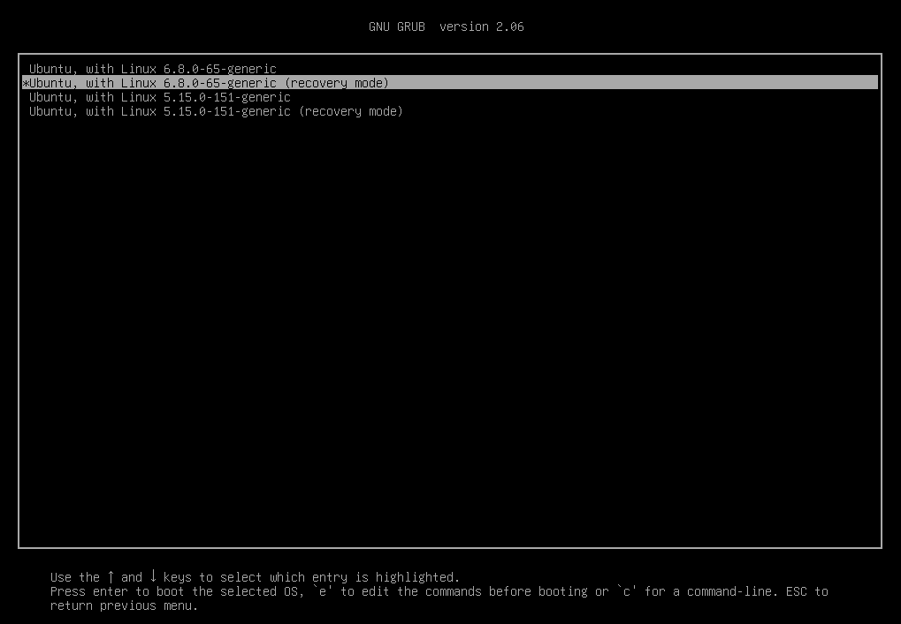
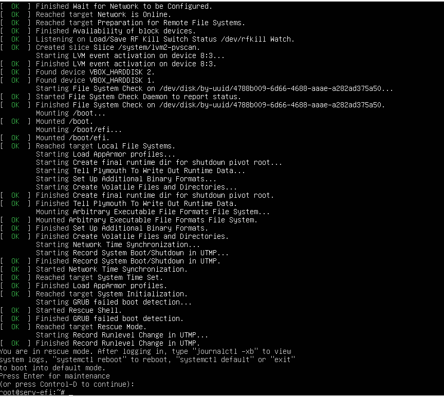
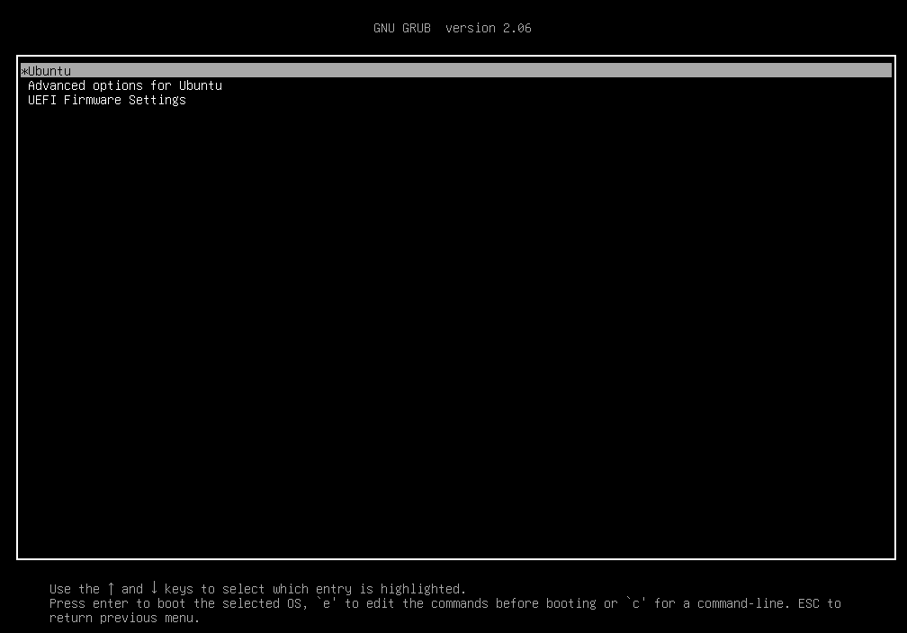
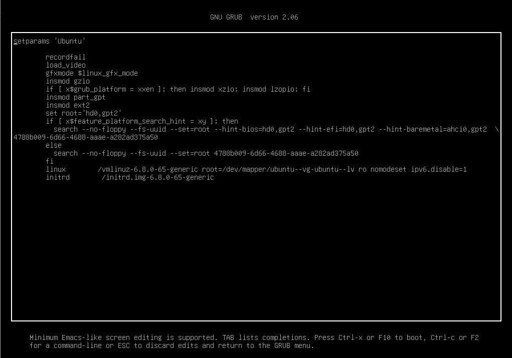
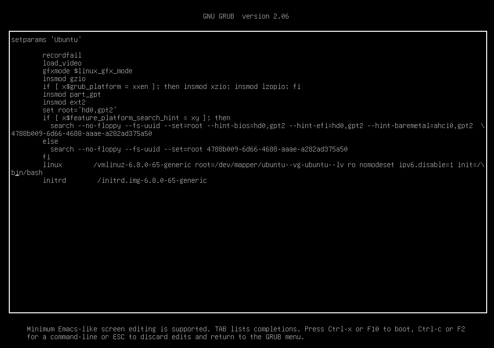

# ProfHW8
<b>Домашнее задание №8. Работа с загрузчиком.</b>

---
Включаем отображение загрузчика GRUB при старте системы
```
starsh@serv-efi:~$ uname -r
6.8.0-65-generic
starsh@serv-efi:~$ cat /etc/os-release
PRETTY_NAME="Ubuntu 22.04.5 LTS"
NAME="Ubuntu"
VERSION_ID="22.04"
VERSION="22.04.5 LTS (Jammy Jellyfish)"
VERSION_CODENAME=jammy
ID=ubuntu
ID_LIKE=debian
HOME_URL="https://www.ubuntu.com/"
SUPPORT_URL="https://help.ubuntu.com/"
BUG_REPORT_URL="https://bugs.launchpad.net/ubuntu/"
PRIVACY_POLICY_URL="https://www.ubuntu.com/legal/terms-and-policies/privacy-policy"
UBUNTU_CODENAME=jammy
```
Вносим изменения в файл /etc/default/grub
```
root@serv-efi:/etc/default# cd
root@serv-efi:~# cd /etc/default/
root@serv-efi:/etc/default# nano grub
root@serv-efi:/etc/default# cat grub
# If you change this file, run 'update-grub' afterwards to update
# /boot/grub/grub.cfg.
# For full documentation of the options in this file, see:
#   info -f grub -n 'Simple configuration'

GRUB_DEFAULT=0
#GRUB_TIMEOUT_STYLE=hidden
GRUB_TIMEOUT=10
GRUB_DISTRIBUTOR=`lsb_release -i -s 2> /dev/null || echo Debian`
GRUB_CMDLINE_LINUX_DEFAULT=""
GRUB_CMDLINE_LINUX="nomodeset ipv6.disable=1"

# Uncomment to enable BadRAM filtering, modify to suit your needs
# This works with Linux (no patch required) and with any kernel that obtains
# the memory map information from GRUB (GNU Mach, kernel of FreeBSD ...)
#GRUB_BADRAM="0x01234567,0xfefefefe,0x89abcdef,0xefefefef"

# Uncomment to disable graphical terminal (grub-pc only)
#GRUB_TERMINAL=console

# The resolution used on graphical terminal
# note that you can use only modes which your graphic card supports via VBE
# you can see them in real GRUB with the command `vbeinfo'
#GRUB_GFXMODE=640x480

# Uncomment if you don't want GRUB to pass "root=UUID=xxx" parameter to Linux
#GRUB_DISABLE_LINUX_UUID=true

# Uncomment to disable generation of recovery mode menu entries
#GRUB_DISABLE_RECOVERY="true"

# Uncomment to get a beep at grub start
#GRUB_INIT_TUNE="480 440 1"
root@serv-efi:/etc/default# update-grub
Sourcing file `/etc/default/grub'
Sourcing file `/etc/default/grub.d/init-select.cfg'
Generating grub configuration file ...
Found linux image: /boot/vmlinuz-6.8.0-65-generic
Found initrd image: /boot/initrd.img-6.8.0-65-generic
Found linux image: /boot/vmlinuz-5.15.0-151-generic
Found initrd image: /boot/initrd.img-5.15.0-151-generic
Warning: os-prober will not be executed to detect other bootable partitions.
Systems on them will not be added to the GRUB boot configuration.
Check GRUB_DISABLE_OS_PROBER documentation entry.
Adding boot menu entry for UEFI Firmware Settings ...
done
root@serv-efi:/etc/default# reboot
```
При старте мы видим отображение загрузчика GRUB
  

---

Входим в операционную систему без пароля  
Способ 1: Вход через Recovery Mode  
  
  
Загружаем ОС в режиме Recovery Mode и нажимаем Enter. Вуаля, мы вошли в систему под пользователем root.  
  
Способ 2: Вход через режим обычной загрузки  
Выбираем режим обычной загрузки  
  
Переходим в режим редактирования команд  
  
Вносим изменения в перечень команд  
  
to be continued special for Jecka
